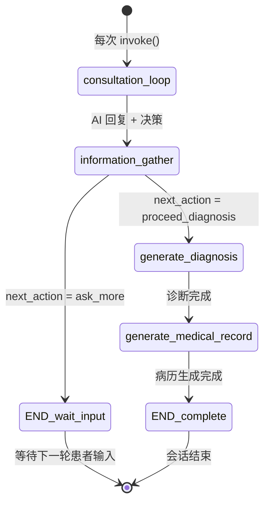
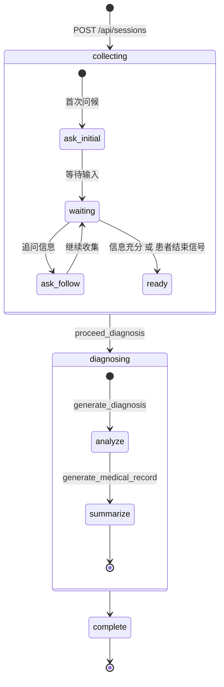
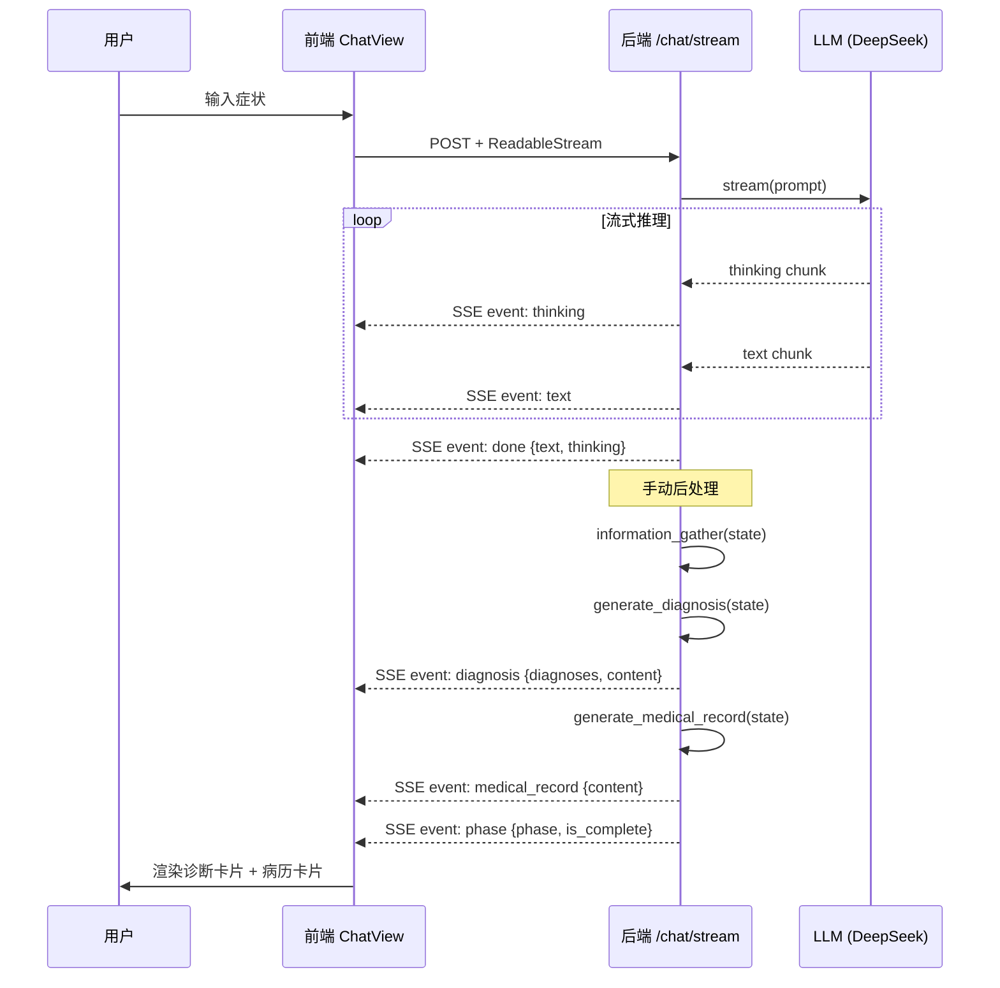
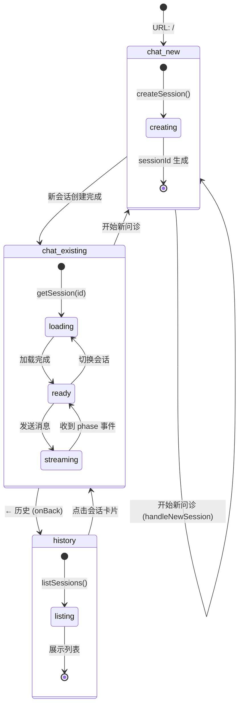

# MedBot 状态转移图

## 1. 对话编排状态机（LangGraph 节点流程）

```mermaid
stateDiagram-v2
    [*] --> consultation_loop : 每次 invoke()

    consultation_loop --> information_gather : AI 回复 + 决策

    information_gather --> END_wait_input : next_action = ask_more
    information_gather --> generate_diagnosis : next_action = proceed_diagnosis

    generate_diagnosis --> generate_medical_record : 诊断完成

    generate_medical_record --> END_complete : 病历生成完成

    END_wait_input --> [*] : 等待下一轮患者输入
    END_complete --> [*] : 会话结束
```

## 2. 会话阶段生命周期

```mermaid
stateDiagram-v2
    [*] --> collecting : POST /api/sessions

    state collecting {
        [*] --> ask_initial : 首次问候
        ask_initial --> waiting : 等待输入
        waiting --> ask_follow : 追问信息
        ask_follow --> waiting : 继续收集
        waiting --> ready : 信息充分 或 患者结束信号
    }

    collecting --> diagnosing : proceed_diagnosis

    state diagnosing {
        [*] --> analyze : generate_diagnosis
        analyze --> summarize : generate_medical_record
        summarize --> [*]
    }

    diagnosing --> complete

    complete --> [*]
```

## 3. SSE 流式事件时序

```mermaid
sequenceDiagram
    participant U as 用户
    participant F as 前端 ChatView
    participant B as 后端 /chat/stream
    participant L as LLM (DeepSeek)

    U->>F: 输入症状
    F->>B: POST + ReadableStream
    B->>L: stream(prompt)

    loop 流式推理
        L-->>B: thinking chunk
        B-->>F: SSE event: thinking
        L-->>B: text chunk
        B-->>F: SSE event: text
    end

    B-->>F: SSE event: done {text, thinking}

    Note over B: 手动后处理
    B->>B: information_gather(state)
    B->>B: generate_diagnosis(state)
    B-->>F: SSE event: diagnosis {diagnoses, content}
    B->>B: generate_medical_record(state)
    B-->>F: SSE event: medical_record {content}
    B-->>F: SSE event: phase {phase, is_complete}

    F->>U: 渲染诊断卡片 + 病历卡片
```

## 4. 前端路由状态

```mermaid
stateDiagram-v2
    [*] --> chat_new : URL: /

    state chat_new {
        [*] --> creating : createSession()
        creating --> [*] : sessionId 生成
    }

    chat_new --> chat_existing : 新会话创建完成

    state history {
        [*] --> listing : listSessions()
        listing --> [*] : 展示列表
    }

    chat_existing --> history : ← 历史 (onBack)
    history --> chat_existing : 点击会话卡片

    state chat_existing {
        [*] --> loading : getSession(id)
        loading --> ready : 加载完成
        ready --> streaming : 发送消息
        streaming --> ready : 收到 phase 事件
        ready --> loading : 切换会话
    }

    chat_new --> chat_new : 开始新问诊 (handleNewSession)
    chat_existing --> chat_new : 开始新问诊
```
